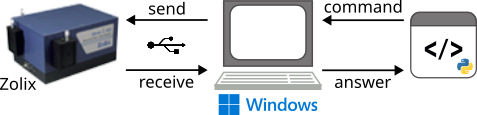
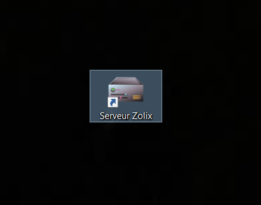

# Python_Wrapper_For_Zolix
Driver wrapper for Omni-λ Zolix monochromator 

## Introduction/Principle ##

this repo contain all files needed to control  Omni-λ Zolix monochromator in python.

the principle is to use a server conected to the monochromator with ominspec and send python instruction as client to the server.

 

> **_NOTE:_** The PC which host the server need to have windows OS. 

## Installation ##

Follow these steps to install 

Download the repository on your PC 

Run the framework installing .exe file [dotNetFx40_Full_x86_x64](Dependencies)

Install the USB driver. Designate the ZOLIX [USB_driver_folder](Dependencies/Driver_USB_Zolix) when Windows detects the USB connection.

Install the OmniSpec SDK setup [“Setup.exe”](Dependencies/OmniSpec-Setup)

Install the Gateway Setup Zolix Server Setup v1.0.

Integrate the [zolix_gateway library](Dependencies/Python_Zolix_Gateway) into your PYTHON 

## fast use ##

### Run the gateway ###

connect the monochromator in usb to the PC and turn on it.

Run the "serveur Zolix" application 

The IHM windows of the server pop up 

click on the "démarrer" button 

the server is now operationnal 

### run python example ###

To run first instruction from python to the monochromator you can use the python  script [example.py](Dependencies/Python_Zolix_Gateway/zolix/app)

All usable  python functions are stored in the [zolix_gateway](Dependencies/Python_Zolix_Gateway/zolix/app) python library. For more documentation about these function you can check the [EN-OperationManual_ZolixOmniSpec](documentation/EN-OperationManual_ZolixOmniSpec.pdf)

